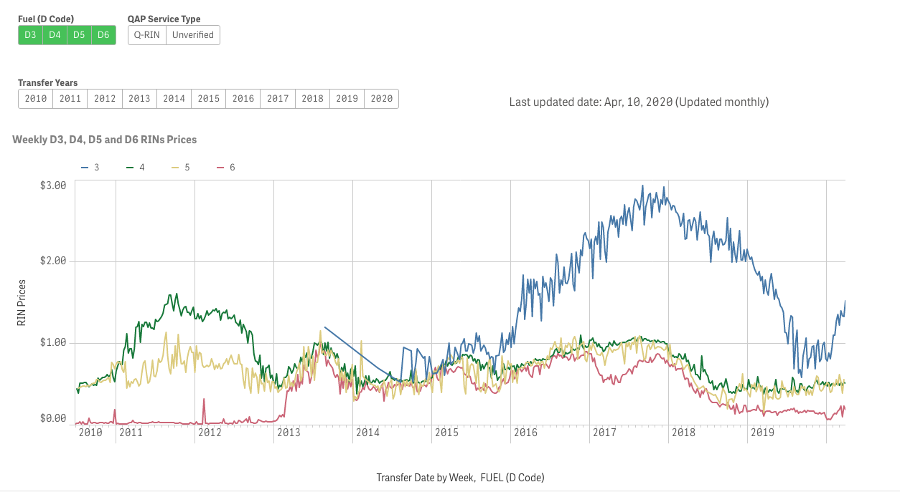

## Welcome to Green Tech Coin

## Token Brand

.png)

> What is an Green Tech Coin or (GTEC)?  
- Ethplorer Mainnet : [0x30e193bd3f52713d5562cf316f35115034525f44](https://ethplorer.io/address/0x30e193bd3f52713d5562cf316f35115034525f44#chart=candlestick)
- Etherscan Mainnet : [0x30e193bd3f52713d5562cf316f35115034525f44](https://etherscan.io/address/0x30E193bd3F52713D5562cf316f35115034525f44)
- Main Features: Run on the ethereum blockchain
- Market Cap 10,000,000,000
- Total supply of GTEC 10,000,000,000  
- Note: The GTEC/HHO Pair is backed by the RIN Credits (Renewable Indentificaton Number)

## Table of Contents
- [Tokenomics](#Tokenomics)
- [Usage](#usage)
- [Wiki](#Wiki)
- [Contribute](#contribute)
- [License](#License)

# Introduction

> The Green Tech Coin, or GTEC, is an Ethereum-based ERC20 token created by iBBT in partnership with internationally known entrepreneurs Nat & Chanida Paranaputra.

> Building on years of research, the GTEC project tackles a simple question: how can human communities thrive in the 21st century while sustaining natural resources and using the benefits of modern technology? The Green Technology Coin project sets out to explore this idea, providing visionary descriptions of green housing and innovative technologies in sustainable energy products, such as hydrogen production and its green housing possibilities.

> The vision for the GTEC token owner is to be rewarded perpetual passive income by supporting projects that the Green Tech Coin or GTEC funds.

> The Token owner will have an opportunity to join an exclusive Ambassador's Club for free that allows members to convert their GTEC tokens into GTEC Non-Fungible Tokens that share up to 30% of a particular project's EBIDTA revenue reward supported in the Ambassador Club. Unfortunately, only 167,100 such GTEC NFTs in the whole Ambassador's Club is available for a lifetime.*

* Some restrictions apply to GTEC Token to NFT conversion. More details are available on Ambassador Club membership and rewards. The GTEC token supports only Ambassador Club-approved projects.

- Note: The HHO Tokens is backed by the RIN Credits (Renewable Indentificaton Number)

# Price of GTEC

# Price of HHO
 
 1 HHO = RIN(D3+D4+D5+D6)/4 = $0.6925

# Proposed Roll-out Strategy

## Tokenomics
[Tokenomics Paper](https://github.com/Green-Tech-Coin/GreenTechCoin/blob/main/docs/Green%20Tech%20Coin%20Tokenomics%20101%20%5Bv1.0%5D.pdf)

## Wiki
[Project Wiki](https://github.com/Green-Tech-Coin/GreenTechCoin/wiki)

## License

See the [LICENSE](LICENSE.md) file for license rights and limitations (GNU AFFERO).
